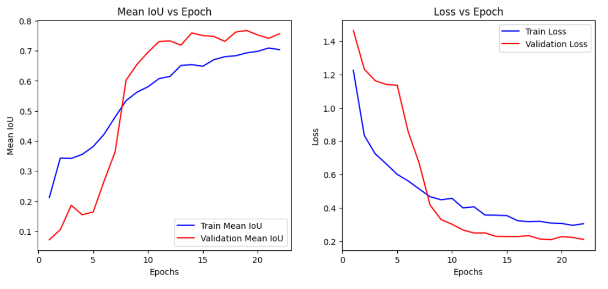

# Drone Safe Landing Zone Segmentation

A multi-class semantic segmentation project to identify **safe landing zones for drones** using high-resolution aerial imagery. This project utilizes **U-Net** with an **EfficientNet-B0** encoder pretrained on ImageNet for robust feature extraction and fast inference.

With the rapid rise of **drone-based delivery systems**, there is an increasing need for intelligent models that can determine **safe and accessible landing spots** using only onboard RGB cameras.
This project was created to fill this gap by providing a **Free and Open Source** solution for drone landing zone detection, using only RGB imagery captured by drone-mounted cameras.

##  Overview

This repository presents a deep learning pipeline (using **TenserFlow- Keras**) for detecting safe drone landing zones from aerial images. The model identifies **5 semantic classes** from high-resolution drone images to determine areas such as landing zones, water, and other terrain features.

###  Features

- **U-Net** architecture with **EfficientNet-B0** encoder
- Pretrained encoder weights from **ImageNet**
- Trained on **custom-labeled drone dataset(publically available on Kaggle)** with 5 classes
- Optimized using **Dice Loss** and **Adam optimizer**
- Evaluated using **Mean Intersection-over-Union (mIoU)**
- Achieves **0.76 mIoU** with **67ms inference time** per image

---

## Model Architecture

- **Encoder**: EfficientNet-B0 (pretrained on ImageNet)
- **Decoder**: U-Net style upsampling
- **Input Shape**: `(736, 960, 3)`
- **Loss Function**: Dice Loss
- **Evaluation Metric**: Intersection-over-Union (IoU)

---

##  Dataset

- 400 custom-labeled **high-resolution aerial images**
- 5 semantic classes including:
  -obstacles
  -water
  -soft-surfaces
  -moving-objects
  -landing-zones

The dataset is publically avaiable at kaggle (https://www.kaggle.com/datasets/santurini/semantic-segmentation-drone-dataset) and I would like to thank the author of this dataset.

---

## Training

- The model was trained for 100 epochs with early stopping(patience = 3), which was triggered at the 34th epoch
- Adam's optimizer was used with a learning rate od 1e-4

## Results

## Future Improvements 

- There are several promising directions for improvement:
1. DeepLabV3+ with ResNet
2. Transformer-based architectures (like SegFormer, Swin UNet)

I encourage ML and computer vision enthusiasts to fork this project and:
- Experiment with different backbones (e.g., ResNet, MobileNet, Swin Transformer)
- Test with other segmentation heads like DeepLabV3+
- Improve accuracy, reduce inference time, or adapt it for real-time deployment

